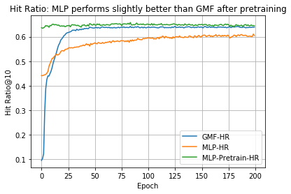
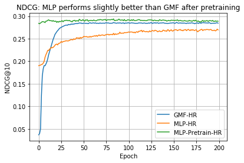

# neural-collaborative-filtering
Neural collaborative filtering(NCF), is a deep learning based framework for making recommendations. The key idea is to learn the user-item interaction using neural networks. Check the follwing paper for details about NCF.

> He, Xiangnan, et al. "Neural collaborative filtering." Proceedings of the 26th International Conference on World Wide Web. International World Wide Web Conferences Steering Committee, 2017.

The authors of NCF actually published [a nice implementation](https://github.com/hexiangnan/neural_collaborative_filtering) written in tensorflow(keras). This repo instead provides my implementation written in **pytorch**. I hope it would be helpful to pytorch fans. Have fun playing with it !

## Dataset
[The Movielens 1M Dataset](http://grouplens.org/datasets/movielens/1m/) is used to test the repo.

## Files

> `data.py`: prepare train/test dataset
>
> `utils.py`: some handy functions for model training etc.
>
> `metrics.py`: evaluation metrics including hit ratio(HR) and NDCG
>
> `gmf.py`: generalized matrix factorization model
>
> `mlp.py`: multi-layer perceptron model
>
> `neumf.py`: fusion of gmf and mlp
>
> `engine.py`: training engine
>
> `train.py`: entry point for train a NCF model

## Performance
The hyper params are not tuned. Better performance can be achieved with careful tuning, especially for the MLP model. Pretraining the user embedding & item embedding might be helpful to improve the performance of the MLP model. 

Experiments' results with `num_negative_samples = 4` and `dim_latent_factor=8`  are shown as follows

Note that the MLP model was trained from scratch but the authors suggest that the performance might be boosted by pretrain the embedding layer with GMF model.

The pretrained version converges much faster.

### L2 regularization for GMF model
Large l2 regularization might lead to the bug of  `HR=0.0 NDCG=0.0`

### L2 regularization for MLP model
a bit l2 regulzrization seems to improve the performance of the MLP model

### MLP with pretrained user/item embedding
Pre-training the MLP model with user/item embedding from the trained GMF gives better result.

MLP network size = [16, 64, 32, 16, 8]

### Implicit feedback without pretrain
Ratings are set to 1 (interacted) or 0 (uninteracted). Train from scratch.
 

### Pytorch Versions
The repo works under torch 1.0. You can find the old versions working under torch 0.2 and 0.4 in **tags**.